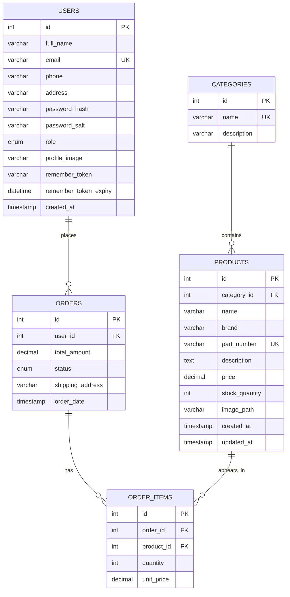

# ERD

Normalization summary:
- First normal form: columns store atomic values and each table has a primary key.
- Second normal form: non-key attributes depend on the whole primary key; many-to-many order product details are separated into `order_items`.
- Third normal form: no transitive dependency such as category name inside `products`; category details live only in `categories`.
