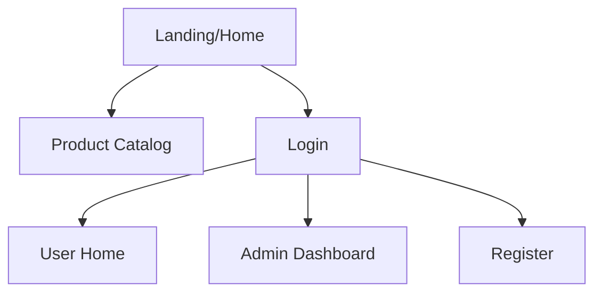
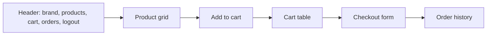
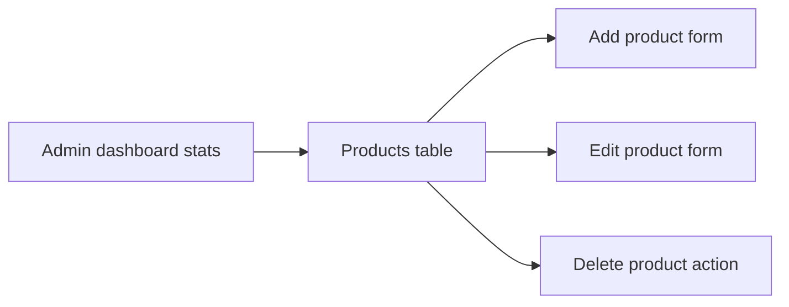

# Wireframe And Prototype Notes

## Public/Login Flow

## User Screens

## Admin Screens

Prototype implementation:
- Shared navigation in `src/main/webapp/components/header.jsp`.
- Responsive layout and visual styling in `src/main/webapp/css/style.css`.
- Customer catalog/cart/order pages in `WEB-INF/views/user`.
- Admin product management pages in `WEB-INF/views/admin`.
